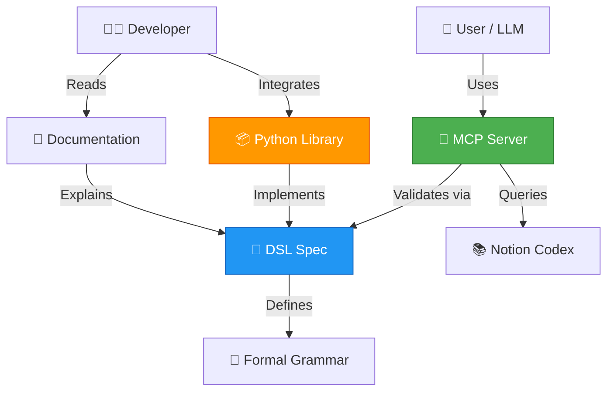

# 🏛️ CompText Ecosystem

> **The Future of LLM Communication** - Token-efficient, structured, production-ready

[](https://opensource.org/licenses/MIT)
[](https://github.com/ProfRandom92/comptext)
[](https://discord.gg/comptext)
[](https://github.com/ProfRandom92/comptext-docs)

## 🌐 Architecture Overview



## 📊 Ecosystem Status

| Repository | Description | Status | Links |
|------------|-------------|--------|-------|
| **[comptext-mcp-server](https://github.com/ProfRandom92/comptext-mcp-server)** | 🚀 Production MCP Server |  | [Docs](https://github.com/ProfRandom92/comptext-mcp-server#readme) · [Deploy](https://railway.app/new) |
| **[comptext-dsl](https://github.com/ProfRandom92/comptext-dsl)** | 📝 Language Specification |  | [Grammar](https://github.com/ProfRandom92/comptext-dsl/blob/main/grammar.ebnf) · [Spec](https://github.com/ProfRandom92/comptext-dsl/tree/main/spec) |
| **[comptext-codex](https://github.com/ProfRandom92/comptext-codex)** | 📦 Python Library |  | [Install](https://github.com/ProfRandom92/comptext-codex#installation) · [API](https://github.com/ProfRandom92/comptext-codex/tree/main/docs/api) |
| **[comptext-docs](https://github.com/ProfRandom92/comptext-docs)** | 📚 Documentation Hub |  | [Website](https://profrandom92.github.io/comptext-docs) · [Guides](https://github.com/ProfRandom92/comptext-docs/tree/main/guides) |

## 🎯 Key Features

- **90-95% Token Reduction** - Compress complex operations into minimal syntax
- **Production Ready** - Used in enterprise environments
- **Type-Safe** - Full validation and error handling
- **Extensible** - Plugin architecture for custom commands

## 🚀 Quick Start

```bash
# Install MCP Server
npm install -g @comptext/mcp-server

# Or use Python library
pip install comptext-codex

# Try it now
comptext-cli "fetch(notion, database='projects', limit=10)"
```

## 📖 Learn More

- 📘 [Getting Started Guide](https://github.com/ProfRandom92/comptext-docs/blob/main/getting-started.md)
- 🎓 [Video Tutorials](https://github.com/ProfRandom92/comptext-docs/tree/main/tutorials)
- 💡 [Use Cases](https://github.com/ProfRandom92/comptext-docs/blob/main/use-cases.md)
- 🤝 [Contributing](./CONTRIBUTING.md)

## 🌟 Community

Join our growing community:

- 💬 [Discord Server](https://discord.gg/comptext)
- 🐦 [Twitter/X Updates](https://twitter.com/comptext)
- 📰 [Blog & News](https://github.com/ProfRandom92/comptext-docs/tree/main/blog)

## 📄 License

MIT License - see [LICENSE](./LICENSE) for details.

---

**Built with ❤️ by the CompText Community**
