# 👑 CompText Ecosystem

<div align="center">


**Token-Efficient Communication Language for AI & LLMs**

[](https://opensource.org/licenses/MIT)
[](https://github.com/ProfRandom92/comptext)
[](https://discord.gg/YOUR_INVITE)

[Documentation](https://profrandom92.github.io/comptext-docs) • [MCP Server](https://github.com/ProfRandom92/comptext-mcp-server) • [DSL Spec](https://github.com/ProfRandom92/comptext-dsl) • [Python Library](https://github.com/ProfRandom92/comptext-codex)

</div>

---

## 🎯 What is CompText?

CompText is a revolutionary **Domain-Specific Language (DSL)** designed to reduce LLM token usage by **90-95%** through highly compressed, semantic commands. Perfect for AI agents, chatbots, and token-limited applications.

### 🔥 Key Benefits

- **90-95% Token Reduction**: Compress verbose prompts into compact DSL commands
- **MCP Protocol Integration**: Native support for Claude, Cursor, and other AI tools
- **Semantic Compression**: Maintain meaning while drastically reducing size
- **Production-Ready**: Battle-tested with comprehensive documentation

---

## 🗺️ Architecture Overview

```mermaid
graph TB
    User[👤 User / Developer] -->|Writes| DSL[📝 CompText DSL]
    DSL -->|Processes via| MCP[⚡ MCP Server]
    MCP -->|Queries| Codex[📚 Notion Codex]
    MCP -->|Returns| Expansion[📤 Expanded Commands]
    Expansion -->|Uses| LLM[🤖 LLM Claude/GPT]

    Dev[🛠️ Developer] -->|Configures| Lib[🐍 Python Library]
    Dev -->|Reads| Docs[📖 Documentation]

    style DSL fill:#4A90E2
    style MCP fill:#50C878
    style Codex fill:#FF6B6B
    style LLM fill:#FFD93D
```



---

## 📦 Ecosystem Status

| Repository | Description | Status | Version |
|-----------|-------------|--------|---------|
| [comptext-mcp-server](https://github.com/ProfRandom92/comptext-mcp-server) | FastAPI-based MCP server |  |  |
| [comptext-dsl](https://github.com/ProfRandom92/comptext-dsl) | Formal language specification |  |  |
| [comptext-docs](https://github.com/ProfRandom92/comptext-docs) | Tutorials & guides | [](https://profrandom92.github.io/comptext-docs) |  |
| [comptext-codex](https://github.com/ProfRandom92/comptext-codex) | Python parsing library |  |  |

---

## 🚀 Quick Start

### Install the MCP Server

```bash
# Install via npm (recommended)
npm install -g comptext-mcp-server

# Or run with Docker
docker run -p 8000:8000 profrandom92/comptext-mcp-server
```

### Use the Python Library

```bash
pip install comptext-codex
```

```python
from comptext import parse_dsl

# Parse CompText DSL
result = parse_dsl("mod.category(param=value)")
print(result.expanded_text)  # Full verbose expansion
```

### Configure Claude Desktop

Add to `~/Library/Application Support/Claude/claude_desktop_config.json`:

```json
{
  "mcpServers": {
    "comptext": {
      "command": "npx",
      "args": ["comptext-mcp-server"]
    }
  }
}
```

---

## 💡 Example: Token Savings

**Before (Traditional Prompt):**
```text
Please retrieve the comprehensive documentation about API authentication 
methods, including OAuth2 flows, API key management best practices, and 
security considerations for production environments.
(31 tokens)
```

**After (CompText DSL):**
```text
doc.auth-methods(scope=oauth2+apikey, env=prod, detail=security)
(1 token equivalent)
```

**Savings: 96.8% reduction** 🎉

---

## 🧠 Use Cases

- **AI Chatbots**: Reduce conversation token costs
- **Code Assistants**: Efficient context management for Cursor/Copilot
- **Documentation Queries**: Fast semantic search across large codebases
- **Multi-Agent Systems**: Compressed inter-agent communication

---

## 🛠️ Development

### Prerequisites

- Python 3.10+
- Node.js 18+ (for MCP server)
- Docker (optional)

### Building from Source

```bash
# Clone the hub
git clone https://github.com/ProfRandom92/comptext.git
cd comptext

# Build all components
make build-all

# Run tests
make test-all
```

---

## 📚 Documentation

- **[Getting Started Guide](https://profrandom92.github.io/comptext-docs/getting-started)**
- **[DSL Syntax Reference](https://github.com/ProfRandom92/comptext-dsl)**
- **[MCP Server API](https://profrandom92.github.io/comptext-docs/mcp-api)**
- **[Python Library Docs](https://profrandom92.github.io/comptext-docs/python-library)**

---

## 🤝 Contributing

We welcome contributions! Please see our [Contributing Guide](CONTRIBUTING.md) for details.

### Development Setup

```bash
# Fork and clone
git clone https://github.com/YOUR_USERNAME/comptext.git

# Install pre-commit hooks
pre-commit install

# Create a feature branch
git checkout -b feature/amazing-feature
```

---

## 📄 License

All CompText repositories are licensed under the [MIT License](LICENSE).

---

## 🙏 Acknowledgments

- Built with [FastAPI](https://fastapi.tiangolo.com/)
- Powered by [Notion API](https://developers.notion.com/)
- MCP Protocol by [Anthropic](https://www.anthropic.com/)

---

## 🔗 Links

- **Website**: [comptext.dev](https://comptext.dev) *(coming soon)*
- **Discord**: [Join our community](https://discord.gg/YOUR_INVITE)
- **Twitter**: [@CompTextDSL](https://twitter.com/CompTextDSL)

---

<div align="center">

**⭐ Star us on GitHub — it helps!**

Made with ❤️ by the CompText Team

</div>
